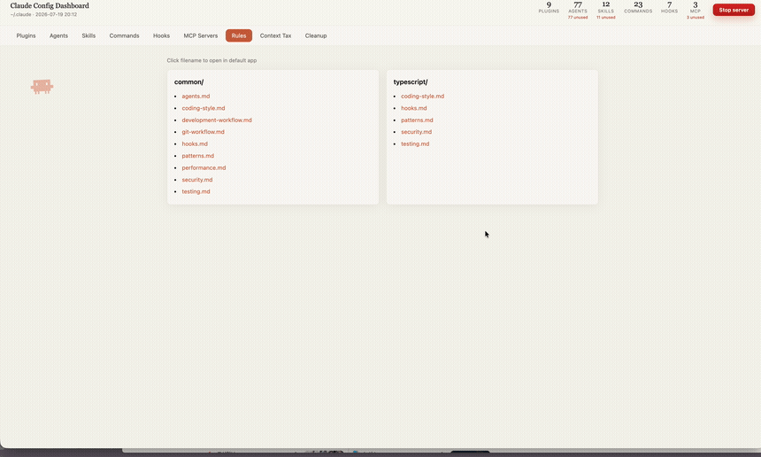

# claude-config-dashboard

[](https://github.com/AshtonYoon/claude-config-dashboard/actions/workflows/ci.yml)
[](https://pypi.org/project/claude-config-dashboard/)
[](https://pypi.org/project/claude-config-dashboard/)
[](LICENSE)

A local web dashboard for everything installed in your `~/.claude` — plugins, agents, skills, commands, hooks, MCP servers, and rules — with usage analytics pulled from your session history, and a project-only view that diffs your current project's `.claude` against your home config. Ships as a standalone CLI (PyPI) and as a Claude Code plugin.

Unlike config *managers*, this is a deliberately **read-only, zero-dependency** analyzer (Python stdlib, no Node/React/build step): it tells you what your config **costs**. The **Context Tax** shows the number of tokens *measured* from your own session transcripts that every session starts with — not a `chars ÷ 4` estimate, so it already includes the system prompt and MCP tool schemas. Alongside it, a home banner surfaces the gap `/context` can't: how many of your installed agents, skills, and MCP servers you've **actually used** (e.g. "77 installed, 4 used"). For anything unused for 30+ days, it can generate a plain shell script that archives it (`mv`, never `rm`) for you to review and run yourself. The dashboard never touches your filesystem on its own. Prefer a straight answer over a browse? `--report` and `--statusline` give you the same measured data as plain text — see below.



## Install & run

**No install, always latest** ([uv](https://docs.astral.sh/uv/)):
```bash
uvx claude-config-dashboard
```

**pip:**
```bash
pip install claude-config-dashboard
claude-config-dashboard
```

**Claude Code plugin** (adds `/claude-config-dashboard:show` and `/claude-config-dashboard:tax`):
```
/plugin marketplace add AshtonYoon/claude-config-dashboard
/plugin install claude-config-dashboard
/reload-plugins
```
then run `/claude-config-dashboard:show` for the web dashboard, or `/claude-config-dashboard:tax` for the plain-text verdict below — no browser needed.

All three install paths open the dashboard at **http://localhost:9876**. Pass `--port` to use a different one, or `--no-open` to skip launching a browser.

## CLI: a verdict without the browser

For a quick answer instead of the full dashboard:

```bash
claude-config-dashboard --report          # plain-text verdict, no server
claude-config-dashboard --report --clean  # ...plus an archive script for idle items
```

```
Claude Config Report
measured from your last 9 sessions (since 2026-05-26)

  Every session starts with      46,708 tokens   (range 34,345-109,104)
    Claude Code baseline         29,699   system prompt + MCP schemas, not cuttable
    Your config                  17,009   <- this is what you control

  Installed vs. actually used (last 30 days)
    Agents  0/77 used      77 idle
    Skills  0/12 used      12 idle
    MCP     0/3 used      3 idle

  Verdict: ~65% of your config (~11,076 tok) is dead weight.
  -> claude-config-dashboard --report --clean   to generate an archive script
     (mv-only, never deletes -- review before running)
```

(Real output from this maintainer's `~/.claude` — the 0/77 isn't a bug: only built-in agent types were invoked in that window, none of the 77 custom-defined ones.)

Same underlying data as the Context Tax and Cleanup tabs, as a single stdout block. In Claude Code, run `/claude-config-dashboard:tax` to get the same thing without leaving the session.

### statusline: always-on

`claude-config-dashboard --statusline` reads Claude Code's [statusLine](https://docs.claude.com/en/docs/claude-code/statusline) JSON payload from stdin and prints one line: this session's measured start-of-context cost, plus how many installed items sit idle (cached in the system tempdir — never inside `~/.claude` — refreshed at most every 5 minutes, so it stays fast). Add it to `~/.claude/settings.json`:

```json
{
  "statusLine": { "type": "command", "command": "claude-config-dashboard --statusline" }
}
```

## Features

| Tab | Contents |
|-----|----------|
| Plugins | Installed plugins with version, GitHub link, install date |
| Agents | Agents grouped by category — click name to open file |
| Skills | Custom and plugin-provided skills |
| Commands | Slash commands with descriptions — click to open file |
| Hooks | Hook scripts by trigger type — click to open script |
| MCP Servers | Configured MCP servers from settings.json and ~/.claude.json |
| Rules | Rule files by category — click to open file |
| Context Tax | Measured tokens every session starts with (from your real session history), a static per-item breakdown of your own config, plus a downloadable cleanup script (archive-only, review before running) for unused items |
| Cleanup | Agents, skills, and MCP servers unused for 30+ days |
| Project-only config | MCP servers, skills, commands, hooks, and rules that exist only in the current project's `.claude` |

Clicking any file name opens it in the OS default app (editor, Finder, etc.). Usage counts and "last used" come from parsing your local session transcripts — nothing leaves your machine.

## Security

The dashboard binds to `localhost` only. Opening a file (`/open`) or stopping the server (`/stop`) requires a per-run token embedded in the page and only accepts paths the dashboard itself is already showing you — a malicious web page open in another tab cannot trigger either endpoint. See [CHANGELOG.md](CHANGELOG.md) (v1.6.1) for the fix history.

## Update

```
/plugin update claude-config-dashboard
/reload-plugins
```

> **If `/plugin update` shows a "browse plugins" prompt instead of updating directly**, the local marketplace cache is stale. Run this once to refresh it:
> ```bash
> cd ~/.claude/plugins/marketplaces/claude-config-dashboard && git pull
> ```
> Then retry `/plugin update claude-config-dashboard`.

`pip`/`uvx` installs pick up new releases automatically the next time you run them (`uvx` always fetches latest; `pip install -U claude-config-dashboard` to upgrade an existing install).

## Development

```bash
git clone https://github.com/AshtonYoon/claude-config-dashboard
cd claude-config-dashboard
uv venv .venv && uv pip install -p .venv pytest pytest-cov ruff

.venv/bin/pytest --cov            # 67 tests, coverage gate at 80%
.venv/bin/ruff check .
.venv/bin/ruff format .
```

The app lives in [`claude_config_dashboard/`](claude_config_dashboard/) (collectors → usage → enrich → render → server); `dashboard.py` at the repo root is a thin backward-compatible launcher for the plugin command. Design notes: [docs/DESIGN.md](docs/DESIGN.md).

## Requirements

- Python ≥ 3.9, standard library only at runtime (no dependencies to install)
- macOS or Linux (uses `open`/`xdg-open` to launch default apps)
